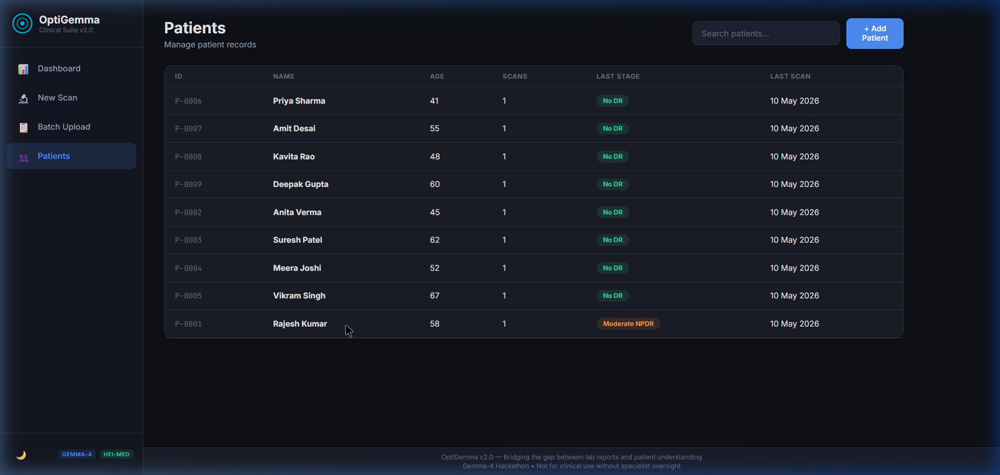
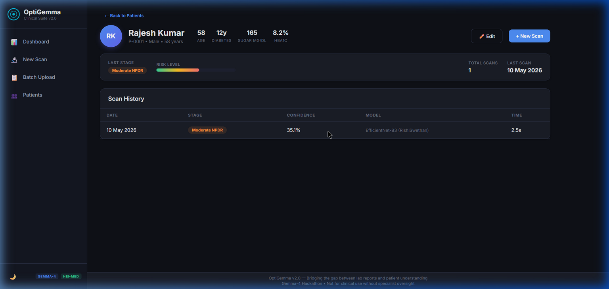
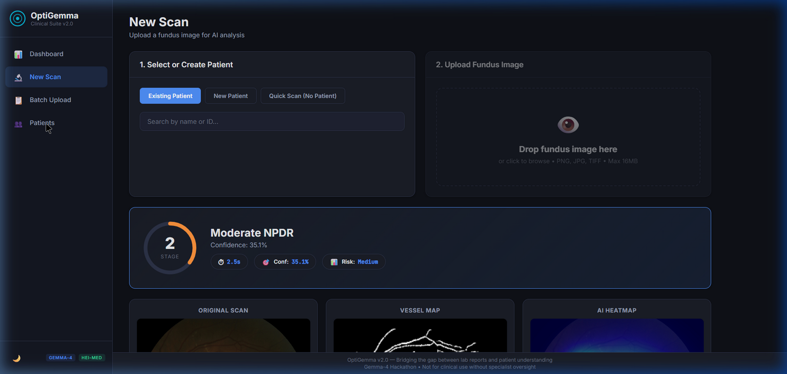
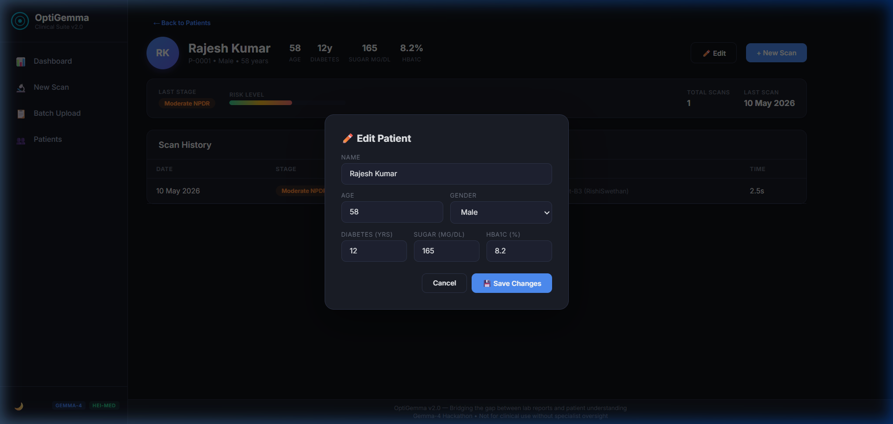

<p align="center">
  <h1 align="center">🔬 OptiGemma — AI-Driven Predictive Retinal Suite</h1>
  <p align="center">
    <b>Early Detection of Diabetic Retinopathy using Deep Learning + Gemma-4 AI Reports</b>
    <br/>
    <i>Built for the Gemma-4 Hackathon</i>
  </p>
</p>

<p align="center">
  
  
  
  
  
</p>

---

## 📖 What is OptiGemma?

**OptiGemma** is an AI-powered clinical suite that screens retinal fundus images for **Diabetic Retinopathy (DR)** — one of the leading causes of preventable blindness worldwide. It combines:

- 🧠 **EfficientNet-B3** deep learning model trained on the HEI-MED dataset for DR stage classification (Stage 0–4)
- 🔥 **Grad-CAM heatmaps** showing which regions of the retina the AI focused on
- 🩸 **Vessel segmentation** analyzing retinal blood vessel density and architecture
- 📝 **Gemma-4 powered diagnostic reports** with plain-language explanations, risk predictions, action plans, and diet recommendations
- 🌐 **Multi-language support** — Reports in English, Hindi, and Gujarati

> **⚠️ Disclaimer:** This is an AI-assisted screening tool for research purposes. It is NOT a substitute for professional medical diagnosis.

---

## ✨ Key Features

| Feature | Description |
|---------|-------------|
| 🔍 **5-Stage DR Detection** | Classifies: No DR → Mild NPDR → Moderate NPDR → Severe NPDR → Proliferative DR |
| 🗺️ **AI Heatmap** | Grad-CAM visualization showing areas of concern on the retina |
| 🩸 **Vessel Analysis** | Automated retinal vessel density measurement and architecture analysis |
| 📊 **Risk Prediction** | 6-month and 12-month progression risk based on clinical data |
| 📝 **AI Reports** | Gemma-4 generates detailed diagnostic reports in plain language |
| 🌐 **Multi-Language** | Reports available in English, Hindi, and Gujarati |
| 👥 **Patient Management** | Full CRUD — create, view, edit, delete patients with scan history |
| 📥 **PDF Export** | Download styled clinical reports with retinal images as PDF |
| 📦 **Batch Upload** | Process multiple patients at once via CSV batch upload |
| ✏️ **Inline Edit** | Professional modal-based patient data editing |

---

## 📸 Screenshots

### Patient Registry
> Dark-themed patient list with stage badges and scan history


### Patient Detail — Clinical Dashboard
> Avatar with initials, hero stats, risk level bar, and scan history


### Scan Results — AI Analysis
> Stage classification with Grad-CAM heatmap and vessel segmentation


### Edit Patient — Modal
> Professional inline editing with pre-filled clinical data


---

## 🏗️ Tech Stack

| Layer | Technology |
|-------|-----------|
| **Frontend** | HTML5, Vanilla CSS, JavaScript (SPA) |
| **Backend** | Python 3.10+, Flask |
| **AI Model** | TensorFlow / Keras — EfficientNet-B3 |
| **Heatmaps** | Grad-CAM (Gradient-weighted Class Activation Mapping) |
| **Vessel Segmentation** | OpenCV + Otsu Thresholding |
| **Report Generation** | Google Gemma-4 API (gemma-2.0-flash) |
| **Translation** | Gemma-4 with system_instruction for strict JSON |
| **Database** | SQLite with WAL mode |
| **PDF Export** | HTML-to-Print (browser native) |

---

## 🚀 Quick Start

### Prerequisites

- **Python 3.10+** installed
- **Google AI Studio API Key** (for Gemma-4 reports) — [Get one here](https://aistudio.google.com/apikey)
- **Git** installed

### 1. Clone the Repository

```bash
git clone https://github.com/yuvrajgitacc/DiabetesRetinopathy.git
cd DiabetesRetinopathy
```

### 2. Create Virtual Environment

```bash
python -m venv venv

# Windows
venv\Scripts\activate

# macOS/Linux
source venv/bin/activate
```

### 3. Install Dependencies

```bash
pip install -r requirements.txt
```

### 4. Setup Environment Variables

Create a `.env` file in the root directory:

```env
GEMINI_API_KEY=your_google_ai_studio_api_key_here
```

### 5. Download the Model

Place the trained model file in the `models/` directory:

```
models/best_model.h5
```

> If you don't have the model, the system will still run but detection accuracy won't be optimal.

### 6. Run the Application

```bash
python app.py
```

The app will start at **http://127.0.0.1:5000**

### 7. (Optional) Seed Demo Data

To populate the database with sample patients:

```bash
python seed_data.py
```

---

## 📁 Project Structure

```
OptiGemma/
├── app.py                  # Flask server — all API routes
├── database.py             # SQLite database layer (Patient & Scan CRUD)
├── config.py               # Configuration and API key loading
├── seed_data.py            # Demo data seeder
├── requirements.txt        # Python dependencies
│
├── engine/                 # AI Pipeline
│   ├── __init__.py
│   ├── detector.py         # EfficientNet-B3 model loading & prediction
│   ├── preprocessor.py     # Image preprocessing pipeline
│   ├── gradcam.py          # Grad-CAM heatmap generation
│   ├── vessel.py           # Retinal vessel segmentation
│   └── gemma_report.py     # Gemma-4 report generation & translation
│
├── models/                 # Trained model files (.h5) — gitignored
│
├── templates/
│   └── index.html          # Single-page application HTML
│
├── static/
│   ├── css/style.css       # Complete UI styling
│   └── js/app.js           # Frontend SPA logic
│
├── docs/screenshots/       # README screenshots
│
├── data/heimed/            # HEI-MED dataset images — gitignored
├── uploads/                # Uploaded fundus images — gitignored
├── results/                # Generated results — gitignored
└── .env                    # API keys — gitignored
```

---

## 🔬 How It Works

```
Fundus Image Upload
        │
        ▼
┌─────────────────┐
│  Preprocessing   │  Resize, normalize, CLAHE enhancement
└────────┬────────┘
         │
         ▼
┌─────────────────┐
│  EfficientNet-B3 │  5-class DR stage classification
│  (Detection)     │  + confidence scores
└────────┬────────┘
         │
    ┌────┴────┐
    ▼         ▼
┌────────┐ ┌──────────┐
│Grad-CAM│ │  Vessel   │  Vessel density, architecture
│Heatmap │ │Segmentati │  analysis using OpenCV
└────┬───┘ └─────┬────┘
     │           │
     └─────┬─────┘
           ▼
┌─────────────────┐
│   Gemma-4 API    │  Generates plain-language report
│  (Report Gen)    │  with risk prediction & action plan
└────────┬────────┘
         │
         ▼
   Clinical Report
   (English/Hindi/Gujarati)
```

---

## 🔑 API Endpoints

| Method | Endpoint | Description |
|--------|----------|-------------|
| `GET` | `/api/dashboard` | Dashboard stats (total patients, scans, stage distribution) |
| `GET` | `/api/patients` | List all patients (supports `?search=` query) |
| `POST` | `/api/patients` | Create a new patient |
| `GET` | `/api/patients/:id` | Get patient detail with scan history |
| `PUT` | `/api/patients/:id` | Update patient info |
| `DELETE` | `/api/patients/:id` | Delete patient and all scans |
| `POST` | `/api/scan` | Upload fundus image → run full AI pipeline |
| `GET` | `/api/scans/:id` | Get scan result with report |
| `POST` | `/translate` | Translate report to Hindi/Gujarati |

---

## 🤝 Contributing

1. Fork the repository
2. Create a feature branch (`git checkout -b feature/my-feature`)
3. Commit your changes (`git commit -m 'Add my feature'`)
4. Push to the branch (`git push origin feature/my-feature`)
5. Open a Pull Request

---

## 📄 License

This project was built for the **Gemma-4 Hackathon**. Feel free to use and modify for educational and research purposes.

---

<p align="center">
  <b>Built with ❤️ using Gemma-4, TensorFlow & Flask</b>
  <br/>
  <i>OptiGemma v2.0 — Bridging the gap between lab reports and patient understanding</i>
</p>
